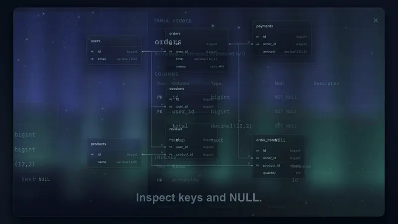
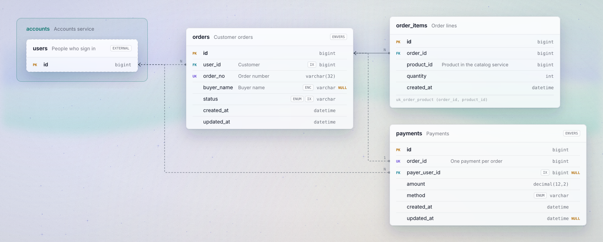

# resin

[](https://github.com/JHZLO/resin/actions/workflows/ci.yml)
[](LICENSE)

**A small language for entity-relationship diagrams.**

resin describes a database schema the way you read DDL: columns, keys, nullability, physical and
logical references, indexes, encrypted columns, audit tables. It checks what you wrote and draws it
as an SVG where every foreign key row is wired to the primary key it points at.

**[Try it in the playground](https://jhzlo.github.io/resin/playground/)** | [Docs](https://jhzlo.github.io/resin/docs/) | [Language reference](docs/SPEC.md) | [Contributing](CONTRIBUTING.md)

Paste DDL from DataGrip or another database tool. Focus on connected entities and trace key
references.

[](https://jhzlo.github.io/resin/#demo)

**[Watch the 32-second demo](https://jhzlo.github.io/resin/#demo)** | [Download MP4 (8.9 MB)](https://jhzlo.github.io/resin/assets/resin-demo.mp4)

<details>
<summary>Example schema and diagram</summary>

<p align="center">
  <picture>
    <source media="(prefers-color-scheme: dark)" srcset="examples/order.aurora-dark.svg">
    
  </picture>
</p>

```erd
external table users "Accounts service" {
  id  bigint  pk
}

table orders "Customer orders" {
  id          bigint       pk
  user_id     bigint       ~> users  "Customer"  index as idx_user_id
  order_no    varchar(32)  uk as uk_order_no  "Order number"
  buyer_name  varchar?     enc  "Buyer name"
  status      varchar      enum(PENDING, PAID, CANCELED)  index as idx_status
  created_at  datetime
  updated_at  datetime
} audit envers(user_id, status)

table order_items "Order lines" {
  id          bigint  pk
  order_id    bigint  -> orders.id  index as ix_order_id
  product_id  bigint
  quantity    int
  unique(order_id, product_id) as uk_order_product
}
```

</details>

## Why

A schema carries facts that its diagram usually loses: which columns may be empty, whether a
reference is a real `FOREIGN KEY` or one only the application keeps, which column points where,
which columns are indexed, unique or encrypted. They end up in notes and comment strings, written by
convention and checked by nobody.

resin makes them syntax. Because the facts are structured, they can be checked (a reference to a
missing table is an error, not a typo in a note), and they can be drawn precisely.

## What it does

`varchar?` is nullable. `->` is a physical foreign key and `~>` a logical one. `uk`, `index`,
`enum(...)`, `enc` and composite `unique(...)` are modifiers, not comments.

References are checked. Missing tables and columns, nullable primary keys, duplicate names and type
mismatches come back with a line, a column and a hint on how to fix them. `external table` declares
a table owned by another service, so references to it are checked too, and the diagram shows where
the boundary is. `audit envers(...)` generates the Hibernate Envers `*_aud` and `revinfo` tables.

resin draws the SVG itself, with each connector running from a foreign key row to the primary key
row it points at. Its default look is plain ink that reads on light and dark pages; the glass looks set
the tables on frosted glass over a background of their own, in three themes (aurora, silk and
caustic), each dark or light. The same input always gives byte-identical output, and the renderer
has no runtime dependencies: it takes an [ELK](https://github.com/kieler/elkjs) instance that you
pass in.

An existing schema does not have to be written by hand. Paste a `CREATE TABLE` script into the
playground, or run `pnpm resin schema.sql --from-sql`, and it comes back as resin: keys, indexes,
foreign keys, enum values and comments carry over, from MySQL, PostgreSQL, SQLite, SQL Server or
Oracle DDL, dumps included. What resin cannot write yet stays as a comment in its table.

In the [playground](https://jhzlo.github.io/resin/playground/) the glass is live: the background drifts, the
stars twinkle and the glass catches the light under your pointer. Click a table name to see its
columns, indexes and relations as tables, or a column to see its details. Connectors can be angular
or curved.

## Getting started

resin is not on npm yet. It needs Node 22.18 or newer (the sources are TypeScript run directly by
Node) and [pnpm](https://pnpm.io).

```bash
git clone https://github.com/JHZLO/resin.git
cd resin
pnpm install
```

Draw a file as SVG:

```bash
pnpm resin examples/order.erd > order.svg
pnpm resin examples/order.erd --look aurora-dark > order.aurora-dark.svg
pnpm resin examples/shop.erd --keys --curved > shop.svg
```

Convert SQL DDL to resin:

```bash
pnpm resin examples/sql/postgres.sql --from-sql > schema.erd
```

Errors come out in compiler format:

```text
schema.erd:3:26: error: referenced table `user` is not in this document
  |
3 |   user_id     bigint  ~> user
  |                          ^^^^
  = hint: declare it with `external table` if it lives outside this document
```

## Using the library

```ts
import ELK from "elkjs";
import { compile, formatDiagnostic, toSvg } from "./src/index.ts";

const result = compile(source);
for (const d of result.diagnostics) console.error(formatDiagnostic(d, source, "schema.erd"));

if (result.model) {
  const { svg } = await toSvg(result.model, new ELK(), { standalone: true });
}
```

`compile` returns the syntax tree, the diagnostics, and, when there are no errors, the resolved
model. `toSvg` draws a model; options choose the look (`graphite`, the
default, or a glass theme such as `aurora-dark`), all columns or key columns only, and folded or
expanded audit tables.

## The language at a glance

| You write | It means |
|---|---|
| `name varchar(32)?` | A nullable column. Without `?` it is NOT NULL |
| `pk`, `uk`, `uk as uk_name` | Primary key, single-column unique (optionally named) |
| `-> table.column`, `~> table` | Physical foreign key; logical reference (defaults to the primary key) |
| `index`, `index as ix_name` | An index starting at this column |
| `enum(A, B)`, `enc` | Allowed values; stored encrypted |
| `unique(a, b) as uk_ab`, `index(a, b)` | Composite constraints |
| `external table t { ... }` | A table owned elsewhere that you can reference |
| `} audit envers(a, b)` | Hibernate Envers audit tables for the listed columns |
| `` `order-items` `` | A name with characters outside `[A-Za-z0-9_]` |

The [docs](https://jhzlo.github.io/resin/docs/) walk through each construct with a diagram for every
example. The full grammar and the rules for cardinality are in the
[language reference](docs/SPEC.md).

## Status

resin is young and pre-1.0. The grammar may still change between minor versions; when it does, the
parser recognizes the old form and tells you how to write it now. See the [changelog](CHANGELOG.md).

## Contributing

Issues and pull requests are welcome. [CONTRIBUTING.md](CONTRIBUTING.md) explains how the project
is laid out and how a grammar change goes from the spec to the implementation.

## License

[MIT](LICENSE)
